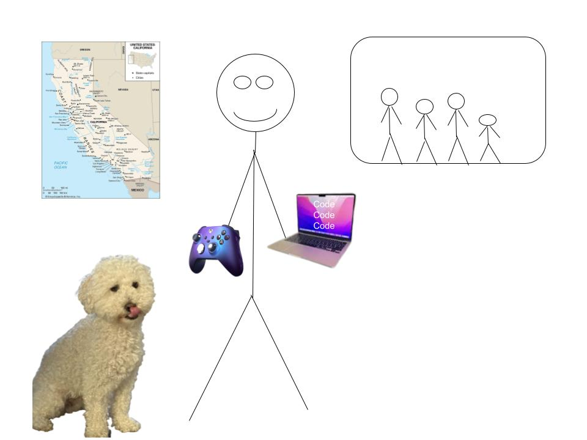

  
  <h1>Colin's Blog!</h1>

 

  <h2>Hi, I'm Colin, and this is my Blog!</h2>
  
This is my blog for APCSA at Del Norte! You can read my blogs about my computer science journey by clicking the "blogs" button on the nav bar or read more about me below:

 

<h3>About Me</h3>

  

    
    <h2>Who am I?</h2>
    
My name is Colin, and I'm a student at DNHS (Del Norte High School).

  

  

    
    <h2>My Family</h2>
    
In my close family I have my parents, my sister, and a maltipoo named Ollie. I also have a large extended family of cousins.

  

  

    
    <h2>Things I like to do</h2>
    
My favorite things to do are going to the beach, playing videogames, and code code coding!

  

  

    
    <h2>My coding journey</h2>
    
I started coding in Scratch. Later, I started taking Java classes, and finally I took APCSP and now APCSA.

  

